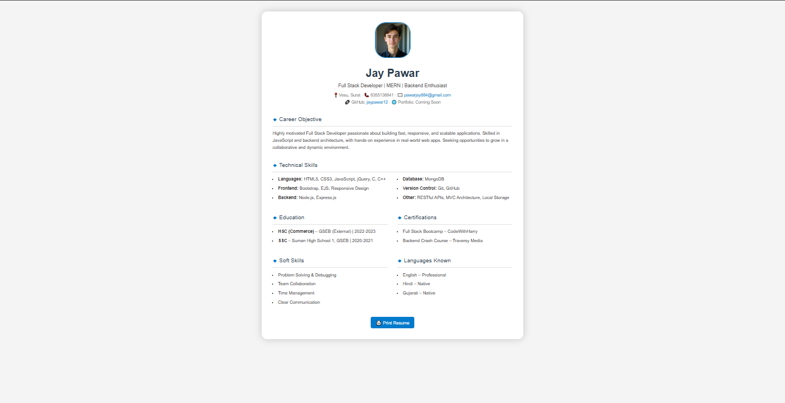
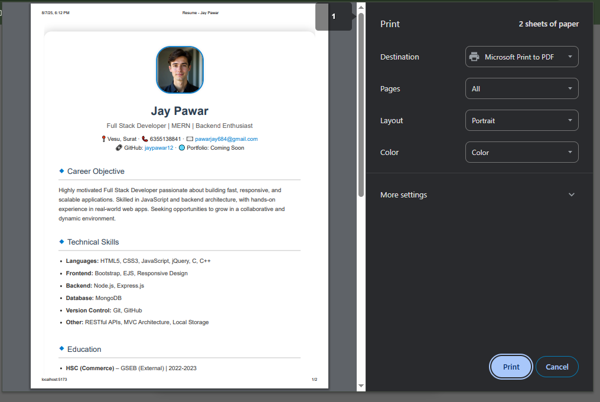

# 📝 React Resume

A modern, responsive **resume website** built with **React.js**.  
It converts my original HTML resume into a reusable React application with modular components and a clean UI.

---

## 📸 Preview




---

## 🚀 Features
- 📄 **Single Page Resume** with all sections (Career Objective, Skills, Projects, Education, Certifications, Soft Skills, Languages)
- 🎨 **Responsive Design** with same layout as original HTML
- 👤 **Profile Picture Support** (circular image in header)
- 🖨️ **Print / Save as PDF** button
- 🧩 **Modular Components** for easy updates
- ⚡ **Fast and SEO-friendly**

---

## 📂 Project Structure

```
resume-react/
├── src/
│ ├── components/
│ │ ├── Header.jsx
│ │ ├── Section.jsx
│ │ ├── Skills.jsx
│ │ ├── Projects.jsx
│ │ ├── Education.jsx
│ │ ├── Certifications.jsx
│ │ ├── SoftSkills.jsx
│ │ ├── Languages.jsx
│ ├── assets/
│ │ └── profile.jpg
│ ├── App.jsx
│ ├── index.css
│ ├── index.js
├── package.json
```

---

## 🛠️ Installation & Setup

1. Clone the repository
   ```bash
   git clone https://github.com/jaypawar12/React-Js.git
   cd react-resume
   ```

2. Install dependencies  
   ```bash
   npm install
   ```

3. Start the development server  
   ```bash
   npm start
   ```

4. Open in browser → http://localhost:3000

---

### 🖼️ Adding Profile Image
- Place your image in `src/assets/profile.jpg`
- It will automatically appear in the header.

---

### 🖨️ Print / PDF
Click the 🖨️ **Print Resume** button to print or save as PDF.

---

## 📌 Future Enhancements
- 🌙 Dark mode support
- 📦 JSON-based dynamic data
- 📄 PDF download with `jspdf` or `react-to-print`
- 🧭 Sidebar layout with sticky profile section

---

## 👨‍💻 Author
**Jay Pawar**  
[🔗 GitHub Profile](https://github.com/jaypawar12)
