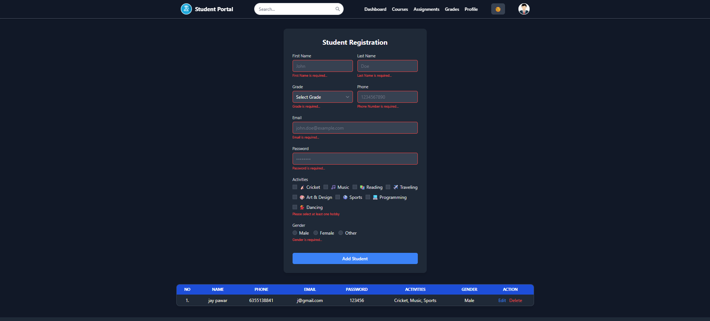
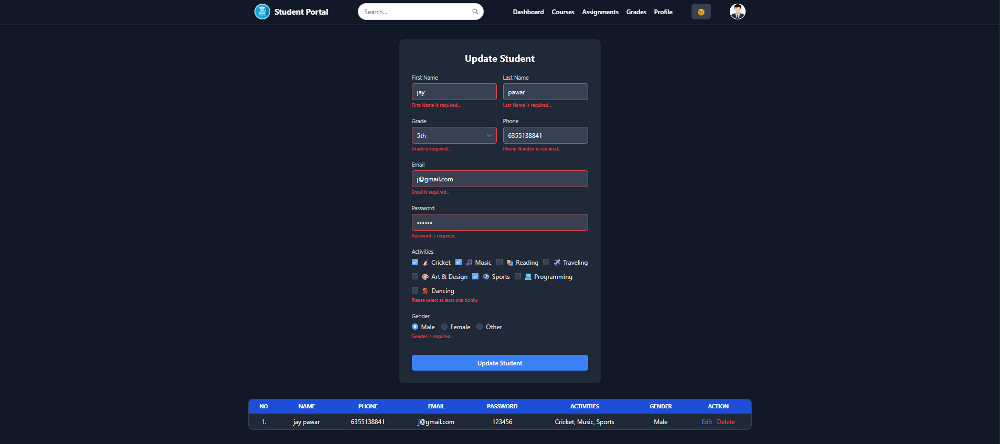

# Learner Registration Form

A responsive and modern **student registration form** built with
**React + TypeScript + TailwindCSS**.\
The form allows users to input student details, select grade, choose
activities, and specify gender.\
All registered students are displayed in a styled table with options to
edit or delete entries.

------------------------------------------------------------------------

## ✨ Features

-   **Fully responsive layout** (mobile-first design)\
-   **Modern UI** styled with TailwindCSS\
-   **Data persistence in localStorage** (no backend required)\
-   **Dynamic activities selection** using checkboxes\
-   **Gender selection** using radio buttons\
-   **Real-time form validation** for required fields, email, phone, and
    password\
-   **Edit and Delete functionality** for students\
-   **Styled table** to list registered students

------------------------------------------------------------------------

## 🚀 Tech Stack

-   **React (with Hooks)**\
-   **TypeScript**\
-   **TailwindCSS**\
-   **Vite** (for lightning-fast dev builds)

------------------------------------------------------------------------

## 📂 Project Structure

    .
    ├── node_modules/          
    ├── public/                
    │   └── img/               
    │       ├── logo.png
    │       ├── profile.jfif
    │       ├── ss-1.png
    │       ├── ss-2.png
    │       ├── ss-3.png
    │       └── ss-4.png
    ├── src/
    │   ├── components/
    │   │   ├── LearnerForm.tsx
    │   │   └── NavBar.tsx
    │   ├── App.tsx
    │   ├── index.css
    │   ├── main.tsx
    │   └── vite-env.d.ts
    ├── .gitignore
    ├── eslint.config.js
    ├── index.html
    ├── package.json
    ├── package-lock.json
    ├── README.md
    ├── tsconfig.app.json
    ├── tsconfig.json
    ├── tsconfig.node.json
    └── vite.config.ts

------------------------------------------------------------------------

## 🛠️ Installation & Setup

1.  **Clone the repository**

    ``` bash
    git clone https://github.com/jaypawar12/React-Js
    cd React-Js
    ```

2.  **Install dependencies**

    ``` bash
    npm install
    ```

3.  **Run development server**

    ``` bash
    npm run dev
    ```

    The app will be available at **http://localhost:5173/** (or
    similar).

4.  **Build for production**

    ``` bash
    npm run build
    ```

------------------------------------------------------------------------

## 📸 Screenshots

> Screenshots of the running app: 
>   
>   
>   
>   

------------------------------------------------------------------------

## 🧩 Customization

-   **Update Grade Options:** Edit the `gradeOptions` array in
    `LearnerForm.tsx`\
-   **Update Activities:** Modify the `activitieList` array\
-   **Integrate Backend:** Replace local state and localStorage with API
    calls (e.g., Axios + Node.js backend)\
-   **Enhance Validation:** Integrate libraries like **Formik** or
    **React Hook Form** for advanced validation rules

------------------------------------------------------------------------

## 🔮 Future Improvements

-   Export student list as CSV/Excel\
-   Theme toggle (Light/Dark) switch\
-   Implement Authentication and Database persistence (MongoDB,
    Firebase, etc.)\
-   Improve accessibility (ARIA roles, keyboard navigation)

------------------------------------------------------------------------

## 👨‍💻 Author

Developed by **[Jay Pawar](https://github.com/jaypawar12)** 🚀
