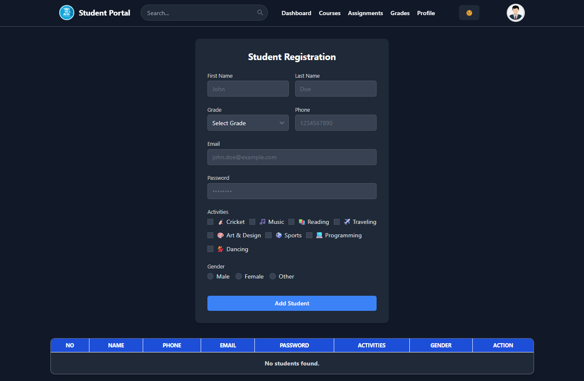
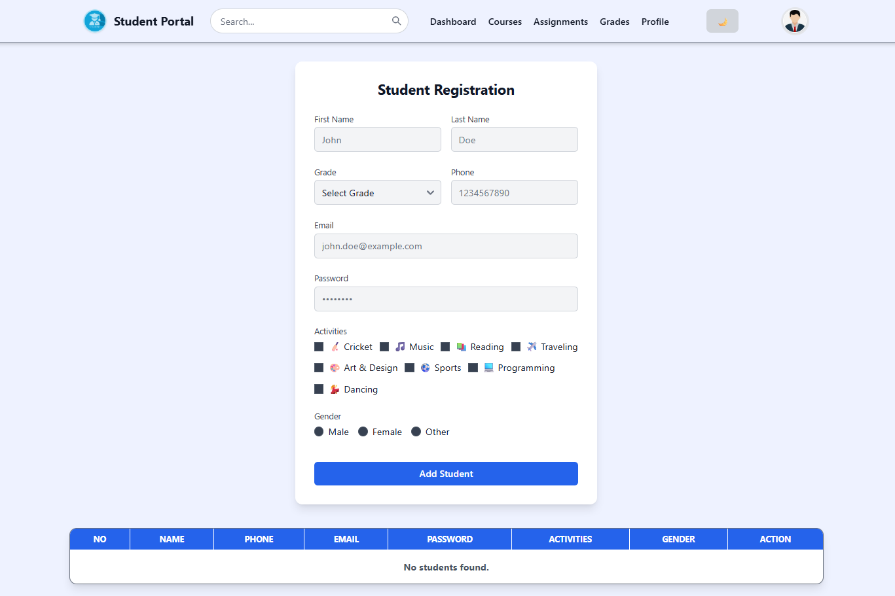

# Learner Registration Form

A responsive and modern **student registration form** built with **React + TypeScript + TailwindCSS**.  
The form allows users to input student details, select grade, choose activities, and specify gender.  
All registered students are displayed in a styled table.  

---

## ✨ Features  
- **Fully responsive layout** (mobile-first design)  
- **Modern UI** with TailwindCSS  
- **Data persistence in component state** (no backend required)  
- **Dynamic activities selection** using checkboxes  
- **Gender selection** using radio buttons  
- **Real-time form validation** for required fields  
- **Styled table** to list registered students  

---

## 🚀 Tech Stack  
- **React (with Hooks)**  
- **TypeScript**  
- **TailwindCSS**  
- **Vite** (for lightning-fast dev builds)  

---

## 📂 Project Structure  

```
.
├── node_modules/          
├── public/                
│   └── img/               
│       ├── logo.png
│       ├── profile.jfif
│       ├── ss-1.png
│       └── ss-2.png
├── src/
│   ├── components/
│   │   ├── NavBar.tsx
│   │   └── StudForm.tsx
│   ├── App.tsx
│   ├── index.css
│   ├── main.tsx
│   └── vite-env.d.ts
├── .gitignore
├── eslint.config.js
├── index.html
├── package.json
├── package-lock.json
├── README.md
├── stud-form.txt
├── tsconfig.app.json
├── tsconfig.json
├── tsconfig.node.json
└── vite.config.ts
```

---

## 🛠️ Installation & Setup  

1. **Clone the repository**  
   ```bash
   git clone https://github.com/jaypawar12/React-Js
   cd React-Js
   ```

2. **Install dependencies**  
   ```bash
   npm install
   ```

3. **Run development server**  
   ```bash
   npm run dev
   ```
   The app will be available at **http://localhost:5173/** (or similar).

4. **Build for production**  
   ```bash
   npm run build
   ```

---

## 📸 Screenshots  

> Screenshots of the running app:  
>   
>   

---

## 🧩 Customization  

- **Update Grade Options:** Modify `gradeOptions` array in `StudForm.tsx`  
- **Update Activities:** Modify `activitieList` array  
- **Integrate Backend:** Replace `useState` with API calls (e.g., Axios + Node.js backend)  
- **Enhance Validation:** Add form libraries like **Formik** or **React Hook Form** for complex rules  

---

## 🔮 Future Improvements  

- Export student list as CSV/Excel  
- Add **Edit/Delete** functionality for rows  
- Integrate authentication and database persistence  
- Dark/light theme toggle  

---

## 👨‍💻 Author  
Developed by **[Jay Pawar](https://github.com/jaypawar12)** 🚀  
