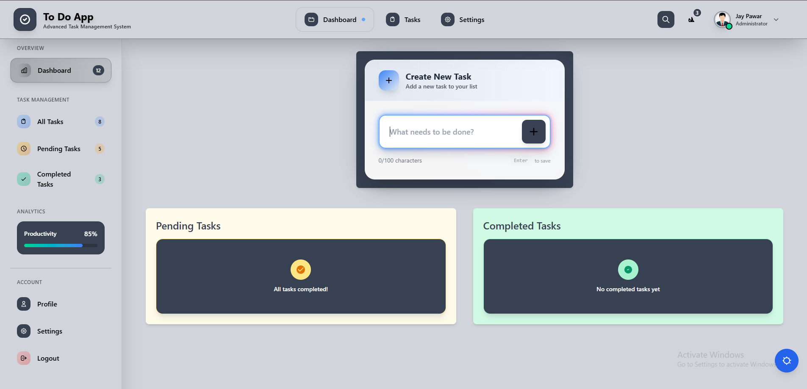
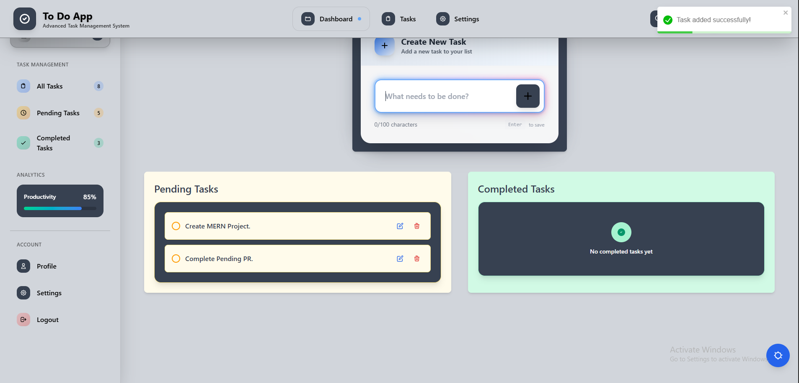
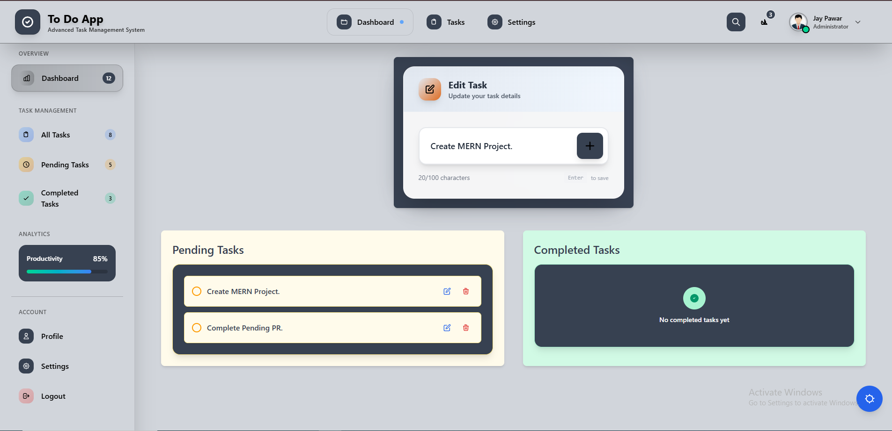
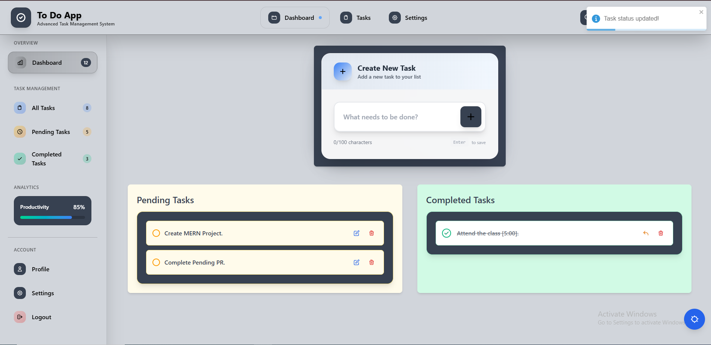
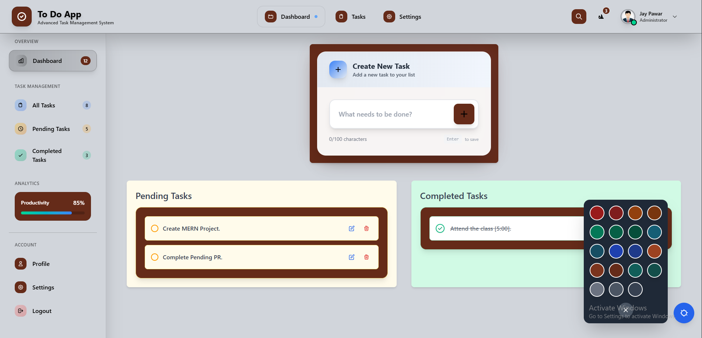

# 📝 To-Do Management Dashboard

A modern, interactive To-Do Management Dashboard built with **React**, **Tailwind CSS**, **TypeScript**, and **React Toastify**.  
Efficiently manage your tasks with features like task addition, editing, completion toggling, deletion, dynamic theme customization, and persistent storage using localStorage.

---

## 🚀 Features

- ✅ Add new tasks  
- ✏️ Edit existing tasks  
- 🎯 Mark tasks as complete or incomplete  
- 🗑️ Delete tasks  
- 💾 Persist tasks in **localStorage**  
- 🌈 Dynamic theme color switcher  
- ⚡ Fully responsive design  
- 📢 Real-time toast notifications  

---

## 🛠️ Tech Stack

- Frontend: React, Tailwind CSS, TypeScript  
- Notifications: React Toastify  
- State Management: React `useState`, `useEffect`  
- Persistent Storage: `localStorage`  
- Theme Color Customization  

---

## 🎯 Installation

1. **Clone the repository:**  
   ```bash
   git clone https://github.com/jaypawar12/React-Js.git
   ```

2. **Navigate to the project directory:**  
   ```bash
   cd To-Do-List-App
   ```

3. **Install dependencies:**  
   ```bash
   npm install
   ```

4. **Start the development server:**  
   ```bash
   npm run dev
   ```
   The app will run at: **http://localhost:5173/**

5. **Build for production:**  
   ```bash
   npm run build
   ```

---

## ⚡ Usage

- Add a new task or edit an existing one via the input form.  
- Toggle task status between "Pending" and "Completed".  
- Delete tasks easily with the delete button.  
- Access the theme panel via the floating button to customize the dashboard theme.  
- All tasks are saved in **localStorage** to persist across sessions.

---

## 🎨 Theme Customization

- Open the theme panel using the floating button.  
- Select from multiple predefined color themes.  
- Instantly apply the chosen theme to the entire dashboard.

---

## 📢 Notifications

Powered by **React Toastify** for real-time feedback:  
- ✅ Task added successfully  
- ✏️ Task updated successfully  
- 🗑️ Task deleted successfully  
- ✅ Task marked as complete  
- 📝 Task marked as incomplete  

---

## 🖼️ Screenshots

Here’s a preview of the dashboard (located in `public/img/`):

  
  
  
  
  

---

## 📁 Project Structure

```
├── node_modules
├── public
│   ├── img
│   │   ├── profile.jfif
│   │   ├── ss-1.PNG
│   │   ├── ss-2.PNG
│   │   ├── ss-3.PNG
│   │   ├── ss-4.PNG
│   │   ├── ss-5.PNG
├── src
│   ├── components
│   │   ├── Navbar.tsx
│   │   ├── SideBar.tsx
│   │   ├── TaskForm.tsx
│   │   ├── TaskPending.tsx
│   │   ├── TaskComplete.tsx
│   ├── App.tsx
│   ├── main.tsx
│   ├── index.css
├── index.html
├── package.json
├── README.md
├── tsconfig.json
├── vite.config.ts
```

---

## ✅ License

This project is licensed under the **[MIT License](https://github.com/jaypawar12/MIT-License)**.

---

## 🤝 Contribution

Contributions are welcome! Feel free to:  
- Fork the project  
- Submit issues  
- Open pull requests  

Your contributions help make this project even better ❤️

---

## 👨‍💻 Author

Developed by **[Jay Pawar](https://github.com/jaypawar12)** 🚀
