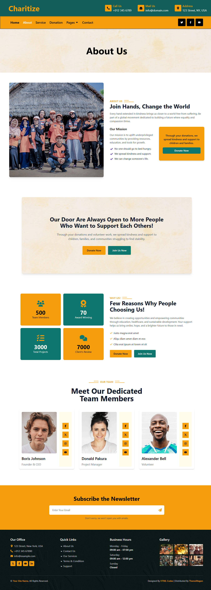
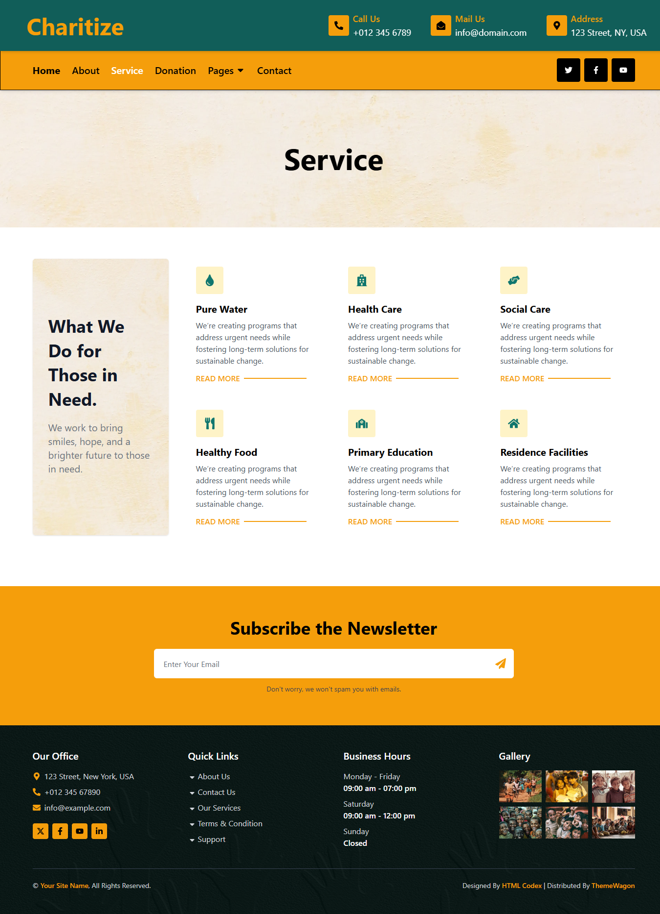
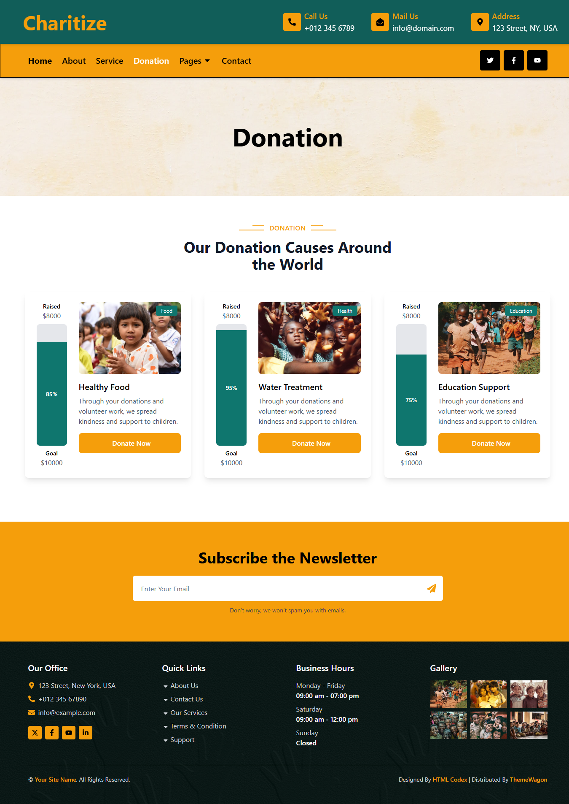

# 🌐 Web Clone with React Router + TypeScript + Vite

A modern, scalable, and maintainable web project built with **React 18**, **TypeScript**, **React Router v6**, and **Vite**.  
This project follows a clean folder structure for better development experience and future scalability.

---

## 📦 Tech Stack

- ⚛️ **React 18**
- 📘 **TypeScript**
- 🛣 **React Router v6**
- ⚡ **Vite**
- 🎨 CSS / TailwindCSS (optional)
- 🧹 ESLint (configured)

---

## 🚀 Getting Started

### 1️⃣ Clone the repository

```bash
git clone https://github.com/jaypawar12/React-Js.git
cd Web-Clone With React-Router


### Install dependencies

```bash
npm install
```

### Run the development server

```bash
npm run dev
```

### Build for production

```bash
npm run build
```

### Lint the code

```bash
npm run lint
```

## 🖼️ Screenshots

Here’s a preview of the dashboard (located in `public/img/`):







## Project Structure

```
src/
│
├── assets/              # Images, fonts, CSS
│   ├── images/
│   └── styles/
│
├── components/          # Reusable UI components
│   ├── Banner.tsx
│   ├── Carousel.tsx
│   ├── NewsLetter.tsx
│   ├── Footer/
│   │   └── Footer.tsx
│   └── Header/
│       └── Header.tsx
│
├── pages/               # Page-level components
│   ├── About/
│   │ ├── About.tsx
│   │ └── AboutPage.tsx
│   ├── Contact/
│   │ ├── Contact.tsx
│   │ └── ContactPage.tsx
│   ├── Donation/
│   │ ├── Donation.tsx
│   │ └── DonationPage.tsx
│   ├── Event/
│   │ ├── Event.tsx
│   │ └── EventPage.tsx
│   ├── Feature/
│   │ ├── Feature.tsx
│   │ └── FeaturePage.tsx
│   ├── Home/
│   │ └── Home.tsx
│   ├── NotFound/
│   │ └── NotFoundPage.tsx
│   ├── OurTeam/
│   │ ├── Team.tsx
│   │ └── OurTeamPage.tsx
│   └── Service/
│   ├── Service.tsx
│   └── ServicePage.tsx
│
├── Routes/ # Centralized route configuration
│ └── routes.ts
│
├── routes/              # Routing configuration
│   └── routes.ts
│
├── types/               # TypeScript interfaces/types
├── utils/               # Helper functions
│
├── App.tsx              # Main App component
├── main.tsx             # Entry point
├── index.css            # Global styles
└── vite-env.d.ts        # Vite + TypeScript config


```

- `src/Components/` - Reusable UI components
- `src/Pages/` - Page components for routing
- `src/Routes/routes.ts` - React Router configuration
- `src/App.tsx` - Main layout component
- `src/main.tsx` - Entry point

## Routing

Routes are defined in `src/Routes/routes.ts` using React Router v6+.

- Example route definition:

```
{
  path: "/about",
  element: <AboutPage />
}

```

## License

Developed by **[Jay Pawar](https://github.com/jaypawar12)** 🚀
